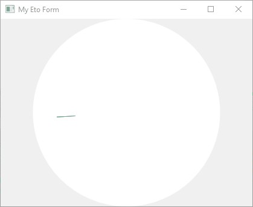

# Eto.RainbowLoading

[](https://github.com/rafntor/Eto.RainbowLoading/actions/workflows/build.yml)
[](https://sonarcloud.io/summary/new_code?id=rafntor_Eto.RainbowLoading)
[](https://www.nuget.org/packages/Eto.RainbowLoading/)
[](LICENSE)

Provides an [Eto.Forms](https://github.com/picoe/Eto) implementation of the famous Android loading indicator. Adapted from [RainbowLoading.Forms](https://github.com/mariusmuntean/RainbowLoading.Forms).

Demo applications : https://nightly.link/rafntor/Eto.RainbowLoading/workflows/build/master

## Quickstart

Use NuGet to install [`Eto.RainbowLoading`](https://www.nuget.org/packages/Eto.RainbowLoading/), then add the following to your Form or Container:
```cs
   this.Content = new RainbowLoading();
```

  
